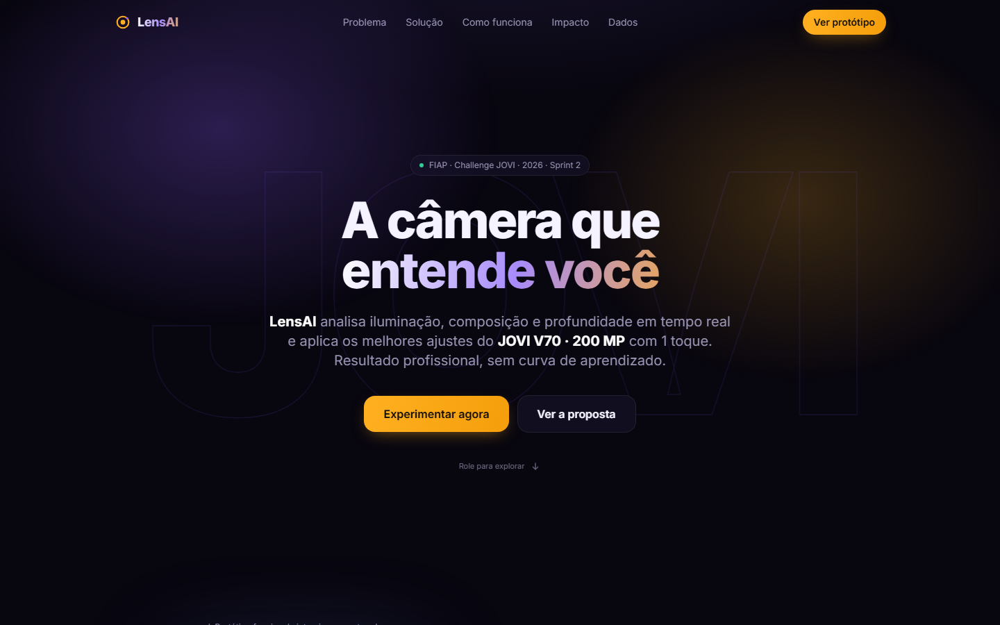

# LensAI · a câmera que entende você

> **FIAP · 1TDS · Challenge JOVI 2026**. Um assistente de câmera com IA para o smartphone **JOVI V70 5G (200 MP)**, feito 100% para a web e pensado primeiro para o celular.


### ▶️ [Abrir o protótipo online](https://zhobbit.github.io/challenge-jovi-lensai/sprint-2/LensAI-Sprint2/)



---

## O desafio

A JOVI pediu uma solução digital **100% web**, responsiva e *mobile first*. O objetivo é melhorar a experiência de câmera e de conteúdo nos smartphones da marca, aumentando o engajamento e a **percepção de desempenho**. A solução precisa simular captura, visualização e compartilhamento, e também diminuir a frustração do usuário com lentidão e complexidade.

## O problema

- **68%** dos usuários nunca mexem nas configurações manuais da câmera.
- As reclamações de "câmera fraca" são **3x** mais frequentes, embora o hardware (200 MP, OIS) seja de topo.
- Ajustes como ISO, EV e temperatura de cor são complexos demais, e o usuário acaba culpando o aparelho.

## A solução: LensAI

A **LensAI** analisa em tempo real a **iluminação**, a **composição** e a **profundidade** da cena. Com base nisso, sugere os melhores ajustes (exposição, Modo Noite, estabilização OIS…) e aplica tudo com **1 toque**. Em vez de corrigir no escuro, ela **ensina**: cada foto recebe um **score de 0 a 100**, e assim o usuário entende o que melhorou.

| Câmera + análise | Sugestões da IA | Galeria Smart | Detalhe da foto |
|:-:|:-:|:-:|:-:|
|  |  |  |  |

---

## Sprints

| Sprint | Entrega | Status | Documentação |
|---|---|---|---|
| **1** | Negócio, modelo de dados (MER) e protótipo no Figma | ✅ Entregue em 20/05/2026 · **nota 10** | [docs/sprint-1](docs/sprint-1/README.md) |
| **2** | Front-end web funcional (HTML, CSS, JS, Tailwind) e apresentação em PDF | ✅ Entregue em 09/2026 | [docs/sprint-2](docs/sprint-2/README.md) |

📖 **O processo de desenvolvimento completo**, com a linha do tempo, as decisões, os problemas e as soluções, está em [docs/PROCESSO.md](docs/PROCESSO.md).

📦 Os pacotes de entrega (ZIP) estão em **[Releases](../../releases)**.

---

## Como rodar o protótipo

**Online:** o protótipo está publicado em https://zhobbit.github.io/challenge-jovi-lensai/sprint-2/LensAI-Sprint2/ (GitHub Pages).

**Localmente:** não precisa de build, dependências nem internet. O Tailwind e a fonte Inter já vêm dentro da pasta `vendor/`.

**Opção 1:** dar duplo clique em [`sprint-2/LensAI-Sprint2/index.html`](sprint-2/LensAI-Sprint2/index.html).

**Opção 2:** usar um servidor local:

```bash
cd sprint-2/LensAI-Sprint2
python -m http.server 8000
```

Depois, acessar `http://localhost:8000`. Para ver como no celular, abra o DevTools (F12) e ative o modo dispositivo (Ctrl+Shift+M).

### Modo captura (screenshots)

Estes parâmetros abrem uma tela específica direto e escondem a landing. Eles foram usados para gerar as imagens da apresentação:

```
index.html?kiosk=1&screen=camera     # câmera + análise de cena
index.html?kiosk=1&screen=suggest    # bottom-sheet de sugestões da IA
index.html?kiosk=1&screen=gallery    # galeria smart
index.html?kiosk=1&screen=photo      # detalhe da foto
```

---

## Estrutura do repositório

```
challenge-jovi-lensai/
├── README.md                  ← você está aqui
├── docs/
│   ├── PROCESSO.md            ← processo de desenvolvimento
│   ├── sprint-1/              ← negócio, MER, telas Figma, PDF da Sprint 1
│   └── sprint-2/              ← front-end, design system, screenshots, PDF da Sprint 2
└── sprint-2/LensAI-Sprint2/   ← código-fonte do protótipo web
```

## Autor

**Victor Holanda**, RM571263 · FIAP 1TDS · 2026
