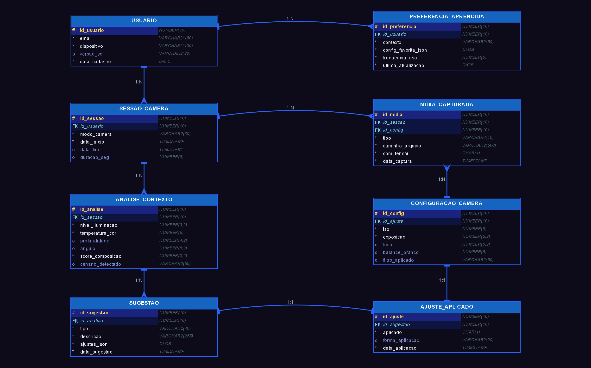
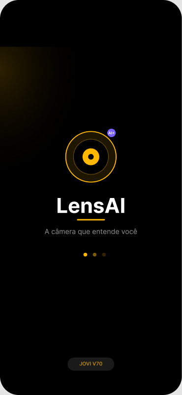
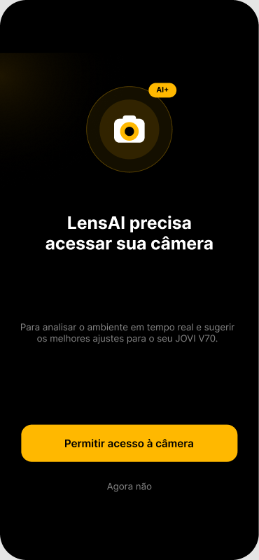
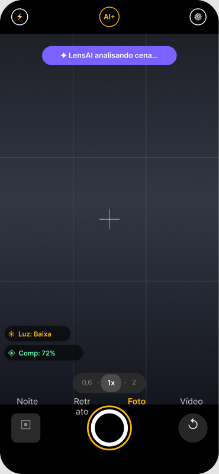
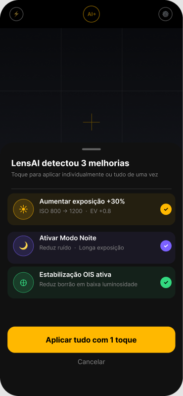
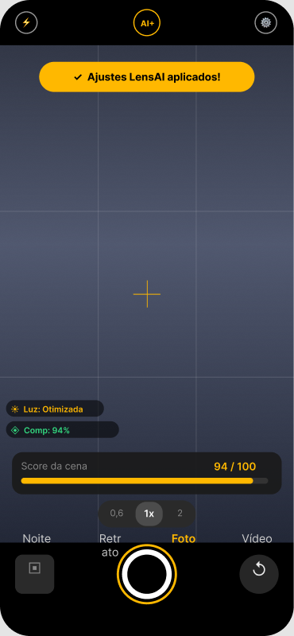
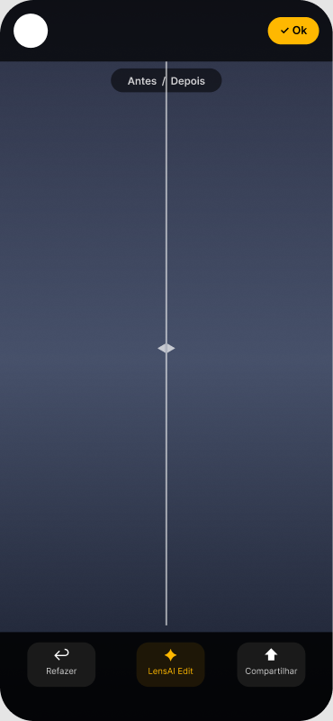
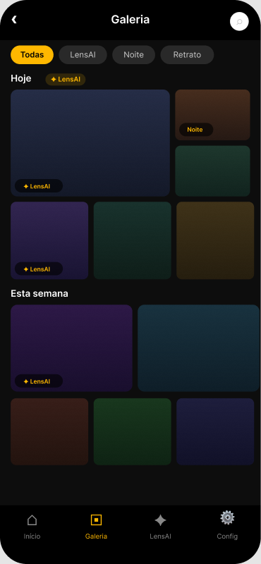
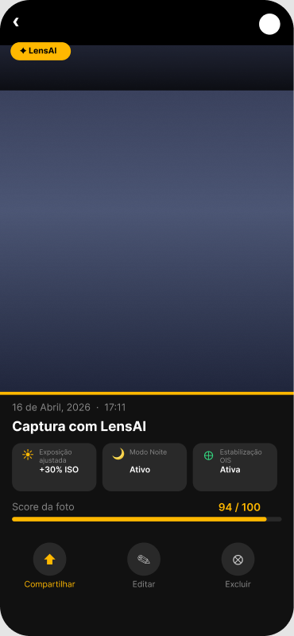
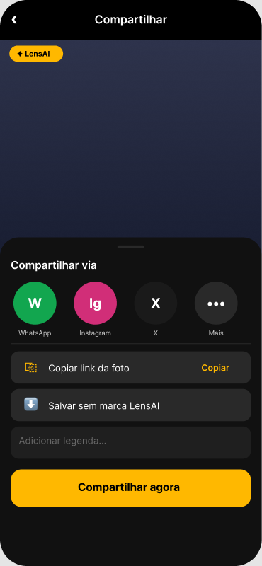

# Sprint 1: Conceito, negócio e modelo de dados

**Entrega:** 20/05/2026 · **Nota:** 10 pontos, com feedback positivo do professor
**Apresentação:** [apresentacao-sprint1.pdf](apresentacao-sprint1.pdf)

A Sprint 1 foi dividida em três etapas: **(1) Negócio**, **(2) Modelo de Dados (MER)** e **(3) Protótipo** navegável no Figma, web e *mobile first*. A entrega final foi apenas um deck em PDF. Os critérios de avaliação eram:

| Critério | Peso |
|---|---|
| Clareza da proposta de negócio | 30% |
| Modelo de dados | 20% |
| Usabilidade da interface | 20% |
| Qualidade visual | 20% |
| Coerência geral | 10% |

---

## Etapa 1: Negócio

### Problema
- **68%** dos usuários nunca usam as configurações manuais da câmera.
- As reclamações de "câmera fraca" são **3x** mais frequentes.
- ISO, EV e temperatura de cor são complexos, e o usuário culpa o hardware em vez da configuração.

### Solução: LensAI
É um assistente de câmera inteligente para o **JOVI V70 (200 MP)**. Um card flutuante de IA lê o ambiente em tempo real (iluminação, composição e profundidade), gera um **score da cena** e sugere os ajustes ideais, que podem ser aplicados com **1 toque**. A ideia é **ensinar** o usuário, e não apenas corrigir no automático.

### Como funciona (3 passos)
1. O usuário abre a câmera.
2. Vê o card de sugestão da IA.
3. Aplica os ajustes, e o score da cena sobe (por exemplo, para 94/100).

### Impacto
- Curva de aprendizado menor.
- Melhor percepção de qualidade e desempenho do aparelho.
- Engajamento orgânico: mais fotos boas geram mais compartilhamento e mais visibilidade para a JOVI.
- Diferenciação frente à concorrência.

---

## Etapa 2: Modelo de Dados (MER)

| Tabela | Colunas | Relação |
|---|---|---|
| **USUARIO** | `ID_USUARIO` PK, `DISPOSITIVO` VARCHAR2(100), `DATA_CADASTRO` DATE | 1:N → SESSAO_CAMERA |
| **SESSAO_CAMERA** | `ID_SESSAO` PK, `ID_USUARIO` FK, `DATA_INICIO` TIMESTAMP, `MODO_CAMERA` VARCHAR2(20) | 1:N → ANALISE_CONTEXTO |
| **ANALISE_CONTEXTO** | `ID_ANALISE` PK, `ID_SESSAO` FK, `NIVEL_ILUMINACAO` NUMBER(5,2), `TEMPERATURA_COR` NUMBER(6,0), `PROFUNDIDADE` NUMBER(5,2), `SCORE_COMPOSICAO` NUMBER(3,0) | 1:N → SUGESTAO |
| **SUGESTAO** | `ID_SUGESTAO` PK, `ID_ANALISE` FK, `TIPO` VARCHAR2(50), `DESCRICAO_USUARIO` VARCHAR2(200), `AJUSTES_JSON` CLOB | |
| **PREFERENCIA_APRENDIDA** | Guarda as preferências do usuário ao longo do tempo, ligada a USUARIO e SUGESTAO | É o que faz "a IA aprender com o usuário" |

Uma versão conceitual simplificada está em [mer/lensai_mer.png](mer/lensai_mer.png).

---

## Etapa 3: Protótipo (Figma)

| 01 Splash | 02 Permissão | 03 Câmera | 04 Sugestão IA | 05 Ajuste aplicado |
|:-:|:-:|:-:|:-:|:-:|
|  |  |  |  |  |

| 06 Preview | 07 Galeria Smart | 08 Detalhe | 09 Compartilhar |
|:-:|:-:|:-:|:-:|
|  |  |  |  |

A identidade visual usa tema escuro, com destaques em roxo e âmbar. Essa identidade foi mantida na Sprint 2.

➡️ Continuação: [Sprint 2](../sprint-2/README.md)
