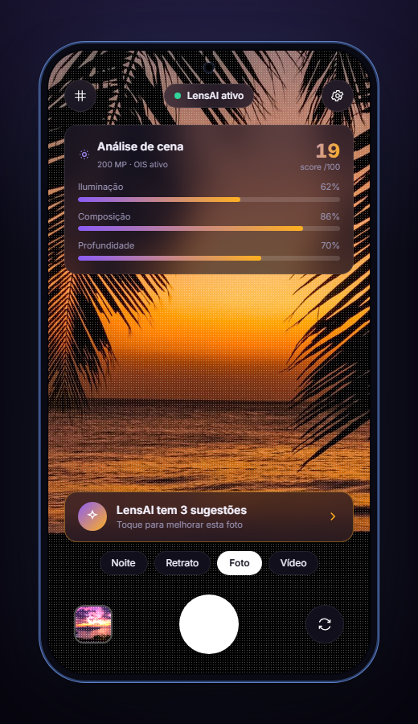
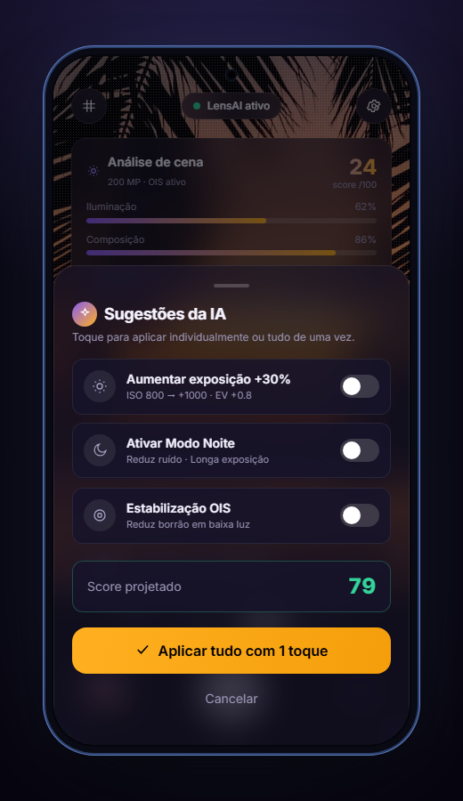
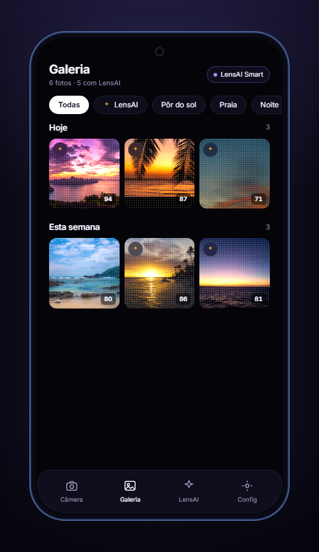
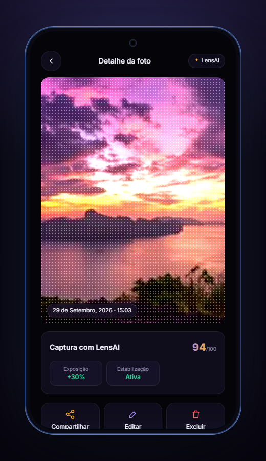

# Sprint 2: Protótipo web funcional

**Entrega:** setembro/2026 · **Valor:** 20 pontos (15 do código + 5 da apresentação em PDF)
**Código:** [`sprint-2/LensAI-Sprint2`](../../sprint-2/LensAI-Sprint2) · **Apresentação:** [apresentacao-sprint2.pdf](apresentacao-sprint2.pdf)

Nesta sprint, o conceito da [Sprint 1](../sprint-1/README.md) virou um **front-end web funcional e interativo**.

## Requisitos e restrições

- Usar **apenas** HTML, CSS, JavaScript e Tailwind **ou** Bootstrap. Escolhemos o **Tailwind**.
- Entregar uma pasta autocontida, compactada em ZIP, **sem links externos**. O protótipo precisa funcionar offline.
- Ser responsivo e *mobile first*.
- Incluir uma apresentação em PDF.

## Arquitetura

```
LensAI-Sprint2/
├─ index.html            → landing em scrollytelling + todas as telas do protótipo
├─ css/styles.css        → tema, animações, glassmorphism, responsividade, focus rings
├─ js/app.js             → estado da jornada, galeria (localStorage), observers de scroll
├─ assets/scenes/        → fotos reais usadas como "cena" da câmera
└─ vendor/
   ├─ tailwind.js        → Tailwind Play CDN 3.4.16 (embutido para uso offline)
   └─ inter-latin.woff2  → fonte Inter variável (embutida)
```

O `app.js` é JavaScript puro, em um único IIFE. As principais peças são:
- `go(screen)`: faz a navegação entre as telas (`splash`, `permission`, `camera`, `gallery`, `photo`, `settings`).
- `liveScore()` / `liveMeters()`: calculam o score e os medidores da cena conforme a cena e os ajustes ativos.
- `openSuggest()` / `applyAll()`: controlam o bottom-sheet de sugestões e o "aplicar tudo com 1 toque".
- `capture()` / `renderGallery()` / `openPhoto()`: fazem a captura, a galeria agrupada por data e o detalhe da foto.
- `store`: é um wrapper de `localStorage` que continua funcionando em modo privado (chave `lensai_gallery_v2`).
- `initScroll()`: cuida das revelações via IntersectionObserver, dos contadores animados, da barra de progresso e da navbar que se esconde.

## Funcionalidades

| Tela | O que faz |
|---|---|
| **Splash** | Boot animado e medição real de desempenho (`performance.now()`, cerca de 88 ms) |
| **Permissão** | Simula o pedido de acesso à câmera |
| **Câmera** | Análise de cena ao vivo (iluminação, composição e profundidade), score reativo, modos Noite/Retrato/Foto/Vídeo, troca de cena, toque para focar |
| **Retrato** | Focais reais do V70: 23/35/50/85 mm (Paisagem/Rua/Clássico/Teleobjetiva), com zoom da cena |
| **Sugestões IA** | Bottom-sheet com Exposição +30%, Modo Noite e OIS. Cada um pode ser ligado sozinho ou todos com "Aplicar tudo", com preview e score projetado |
| **Galeria Smart** | Abas Todas/LensAI/Pôr do sol/Praia/Noite, agrupamento por Hoje/Esta semana, persistência em localStorage |
| **Detalhe da foto** | Metadados, score, editor rápido com sliders, compartilhar (share sheet) e excluir com confirmação |
| **Configurações** | Sugestões automáticas, Modo Noite automático, grade de composição (regra dos terços), salvar metadados, feedback tátil |

A **landing** tem hero com a marca "JOVI" em contorno e parallax, as seções Problema/Solução/Como funciona/Impacto/Dados com contadores animados (68%, 3x), uma faixa de cores do V70 (Lilás Boreal e Azul Safira) e chips de especificações (200 MP OIS, 7000 mAh, 90 W FlashCharge, IP68/69).

| Câmera | Sugestões | Galeria | Detalhe |
|:-:|:-:|:-:|:-:|
|  |  |  |  |

## Design system

- **Tema:** escuro, com glassmorphism.
- **Cores:** violeta `#8B5CF6` e âmbar `#FFB020`, o âmbar herdado da marca da Sprint 1.
- **Tipografia:** Inter variável, embutida.
- **Mockup:** inspirado no vivo/JOVI V70 5G real, com câmera frontal em furo (*punch-hole*) e moldura metálica azul-safira.
- **Acessibilidade:** focus rings visíveis, `aria-*` nas telas e controles, respeito a `prefers-reduced-motion`.

## Entrega

O arquivo `Entrega-Sprint2-LensAI-RM571263.zip` contém o código, o PDF e o `LEIA-ME.txt`. Ele está disponível na **Release `v2.0-sprint2`** deste repositório.

O processo e as decisões desta sprint estão em [PROCESSO.md](../PROCESSO.md).
